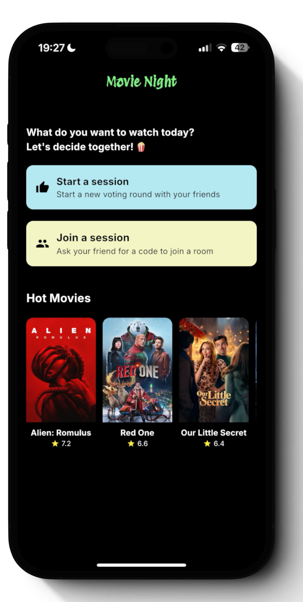

# Movie Night



## Table of Contents

- [Movie Night](#movie-night)
  - [Table of Contents](#table-of-contents)
  - [Description](#description)
  - [Features](#features)
  - [Technologies Used](#technologies-used)
  - [Installation](#installation)
  - [Usage](#usage)
  - [Screenshots](#screenshots)
  - [Contributing](#contributing)
  - [License](#license)
  - [Contact](#contact)

## Description

**Movie Night** is a Flutter-based mobile application designed to help friends and families collaboratively decide on a movie to watch. By allowing users to start or join a voting session, Movie Night facilitates an interactive and enjoyable way to select movies through a swipe-based voting system. Whether you're hosting a movie marathon or just picking a film for the evening, Movie Night ensures that everyone has a say in the final choice.

## Features

- **User Sessions:** Start a new voting session or join an existing one using a unique 4-digit code.
- **Swipe Voting:** Swipe right to like a movie or left to dislike it, similar to popular dating apps.
- **Real-time Matching:** Receive real-time feedback when a movie receives enough likes to become a match.
- **Hot Movies Carousel:** Browse through a curated list of trending movies fetched from TMDB.
- **Responsive Design:** Optimized for both Android and iOS devices with a sleek and intuitive UI.
- **Session Persistence:** Sessions are saved locally to ensure continuity across app restarts.

## Technologies Used

- **Framework:** [Flutter](https://flutter.dev/) for building the cross-platform mobile application.
- **Language:** Dart
- **APIs:**
  - [The Movie Database (TMDB) API](https://www.themoviedb.org/documentation/api) for fetching movie data.
  - Custom [Movie Night API](https://movie-night-api.onrender.com) for session and voting functionalities.
- **State Management:** Flutter's `StatefulWidget` and service classes.
- **Storage:** [Shared Preferences](https://pub.dev/packages/shared_preferences) for local data persistence.
- **Additional Libraries:**
  - `http` for making network requests.
  - `swipe_cards` for implementing the swipe-based voting interface.
  - `platform_device_id` for retrieving device-specific identifiers.
  - `flutter_native_splash` for splash screen management.
  - `intl` for date formatting.

## Installation

Follow these steps to set up and run Movie Night on your local machine:

### Prerequisites

- **Flutter SDK:** Ensure you have Flutter installed. Follow the [official Flutter installation guide](https://flutter.dev/docs/get-started/install) for your operating system.
- **Dart SDK:** Included with Flutter.
- **Device or Emulator:** A physical device connected via USB or an emulator/simulator set up.

### Steps

1. **Clone the Repository:**
    ```bash
    git clone https://github.com/cort0038/movie-night.git
    ```
2. **Navigate to the Project Directory:**
    ```bash
    cd movie-night
    ```
3. **Install Dependencies:**
    ```bash
    flutter pub get
    ```
4. **Set Up Environment Variables:**
    - **TMDB API Key:** Obtain an API key from [TMDB](https://www.themoviedb.org/documentation/api).
    - **Create a `.env` File:**
        - In the root directory, create a `.env` file and add the following:
            ```
            TMDB_API_KEY=your_tmdb_api_key
            MOVIE_NIGHT_API_URL=https://movie-night-api.onrender.com
            ```
    - **Note:** Ensure that your `.env` file is included in `.gitignore` to prevent sensitive information from being exposed.
5. **Run the App:**
    ```bash
    flutter run
    ```
6. **Build for Release:**
    - For Android:
        ```bash
        flutter build apk --release
        ```
    - For iOS:
        ```bash
        flutter build ios --release
        ```

## Usage

Once the app is installed on your device, follow these steps to use Movie Night:

1. **Launch the App:**
    - Open Movie Night on your device to view the welcome screen.

2. **Start or Join a Session:**
    - **Start a Session:**
        - Tap on the "Start a session" button.
        - A unique 4-digit code will be generated. Share this code with your friends or family.
    - **Join a Session:**
        - Tap on the "Join a session" button.
        - Enter the 4-digit code provided by the session host to join the voting session.

3. **Vote on Movies:**
    - Browse through the list of movies displayed in a swipe-based interface.
    - **Swipe Right:** Like the movie.
    - **Swipe Left:** Dislike the movie.
    - Votes are recorded in real-time, and a match is determined when a movie receives enough likes from participants.

4. **View Hot Movies:**
    - On the welcome screen, scroll through the "Hot Movies" carousel to see trending films.

5. **Session Completion:**
    - Once a movie receives enough votes to be a match, a dialog will display the matched movie details.
    - You can then proceed to watch the selected movie together.

<!-- ## Screenshots

Including screenshots helps users visualize the application and understand its interface and functionality.


*Description: The welcome screen where users can start or join a voting session.*


*Description: Modal dialog for starting a new session and sharing the unique code.*


*Description: Modal dialog for joining an existing session using a 4-digit code.*


*Description: Swipe-based interface for voting on movies.*


*Description: Dialog displayed when a movie receives enough votes to become a match.* -->

<!-- ## Contributing

Contributions are welcome! Follow these steps to contribute to Movie Night:

1. **Fork the Repository:**
    - Click the "Fork" button on the repository page to create your own fork.

2. **Clone Your Fork:**
    ```bash
    git clone https://github.com/yourusername/movie-night.git
    ```

3. **Create a New Branch:**
    ```bash
    git checkout -b feature/YourFeatureName
    ```

4. **Make Changes:**
    - Implement your feature or fix bugs in the codebase.

5. **Commit Changes:**
    ```bash
    git commit -m "Add Your Feature or Fix"
    ```

6. **Push to Branch:**
    ```bash
    git push origin feature/YourFeatureName
    ```

7. **Open a Pull Request:**
    - Navigate to your forked repository on GitHub and click the "Compare & pull request" button.
    - Provide a clear description of your changes and submit the pull request.

### Guidelines

- **Code Style:** Follow Dart and Flutter best practices for code style and formatting.
- **Testing:** Ensure that your changes do not break existing functionality. Write tests if applicable.
- **Documentation:** Update the README or add relevant documentation for new features. -->

## License

This project is licensed under the [MIT License](LICENSE). 

> **MIT License**
>
> Permission is hereby granted, free of charge, to any person obtaining a copy...
> *(Include the full MIT License text or link to a `LICENSE` file in your repository.)*

## Contact

For any questions, feedback, or support, feel free to reach out:

- **Email:** [cort0038@algonquinlive.com](mailto:cort0038@algonquinlive.com)
- **GitHub:** [cort0038](https://github.com/cort0038)
- **LinkedIn:** [Luis Cortorreal](https://www.linkedin.com/in/luiscortorreal)

---

Thank you for using **Movie Night**! I hope it enhances your movie-watching experiences with friends and family. If you encounter any issues or have suggestions for improvement, please don't hesitate to contact me.

